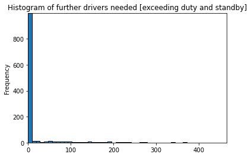

# Agenda 
1. General Data Properties
2. Access the quality of the data
    1. Checking incorrect value types
    2. Missing values and empty data & incorrect or invalid values
    3. Outliers and non relevant data
3. Data Wrangling & Analysis

## 1. General Data Properties


```python
import pandas as pd
import numpy as np 
import matplotlib.pyplot as plt


from statsmodels.tsa.seasonal import seasonal_decompose
from statsmodels.graphics.tsaplots import month_plot, quarter_plot
from statsmodels.tsa.stattools import adfuller

%matplotlib inline
```


```python
# Read in the given data and set the index column to the date column and parse the dates
df=pd.read_csv("../01_data_source/sickness_table.csv", index_col="date", parse_dates=True ) 
df.index.freq="D" #Set the frequence to Daily
df.index
```


    DatetimeIndex(['2016-04-01', '2016-04-02', '2016-04-03', '2016-04-04',
                   '2016-04-05', '2016-04-06', '2016-04-07', '2016-04-08',
                   '2016-04-09', '2016-04-10',
                   ...
                   '2019-05-18', '2019-05-19', '2019-05-20', '2019-05-21',
                   '2019-05-22', '2019-05-23', '2019-05-24', '2019-05-25',
                   '2019-05-26', '2019-05-27'],
                  dtype='datetime64[ns]', name='date', length=1152, freq='D')


```python
df.head()
```


<div>
<style scoped>
    .dataframe tbody tr th:only-of-type {
        vertical-align: middle;
    }

    .dataframe tbody tr th {
        vertical-align: top;
    }

    .dataframe thead th {
        text-align: right;
    }
</style>
<table border="1" class="dataframe">
  <thead>
    <tr style="text-align: right;">
      <th></th>
      <th>Unnamed: 0</th>
      <th>n_sick</th>
      <th>calls</th>
      <th>n_duty</th>
      <th>n_sby</th>
      <th>sby_need</th>
      <th>dafted</th>
    </tr>
    <tr>
      <th>date</th>
      <th></th>
      <th></th>
      <th></th>
      <th></th>
      <th></th>
      <th></th>
      <th></th>
    </tr>
  </thead>
  <tbody>
    <tr>
      <th>2016-04-01</th>
      <td>0</td>
      <td>73</td>
      <td>8154.0</td>
      <td>1700</td>
      <td>90</td>
      <td>4.0</td>
      <td>0.0</td>
    </tr>
    <tr>
      <th>2016-04-02</th>
      <td>1</td>
      <td>64</td>
      <td>8526.0</td>
      <td>1700</td>
      <td>90</td>
      <td>70.0</td>
      <td>0.0</td>
    </tr>
    <tr>
      <th>2016-04-03</th>
      <td>2</td>
      <td>68</td>
      <td>8088.0</td>
      <td>1700</td>
      <td>90</td>
      <td>0.0</td>
      <td>0.0</td>
    </tr>
    <tr>
      <th>2016-04-04</th>
      <td>3</td>
      <td>71</td>
      <td>7044.0</td>
      <td>1700</td>
      <td>90</td>
      <td>0.0</td>
      <td>0.0</td>
    </tr>
    <tr>
      <th>2016-04-05</th>
      <td>4</td>
      <td>63</td>
      <td>7236.0</td>
      <td>1700</td>
      <td>90</td>
      <td>0.0</td>
      <td>0.0</td>
    </tr>
  </tbody>
</table>
</div>


```python
df.describe()
```


<div>
<style scoped>
    .dataframe tbody tr th:only-of-type {
        vertical-align: middle;
    }

    .dataframe tbody tr th {
        vertical-align: top;
    }

    .dataframe thead th {
        text-align: right;
    }
</style>
<table border="1" class="dataframe">
  <thead>
    <tr style="text-align: right;">
      <th></th>
      <th>Unnamed: 0</th>
      <th>n_sick</th>
      <th>calls</th>
      <th>n_duty</th>
      <th>n_sby</th>
      <th>sby_need</th>
      <th>dafted</th>
    </tr>
  </thead>
  <tbody>
    <tr>
      <th>count</th>
      <td>1152.000000</td>
      <td>1152.000000</td>
      <td>1152.000000</td>
      <td>1152.000000</td>
      <td>1152.0</td>
      <td>1152.000000</td>
      <td>1152.000000</td>
    </tr>
    <tr>
      <th>mean</th>
      <td>575.500000</td>
      <td>68.808160</td>
      <td>7919.531250</td>
      <td>1820.572917</td>
      <td>90.0</td>
      <td>34.718750</td>
      <td>16.335938</td>
    </tr>
    <tr>
      <th>std</th>
      <td>332.698061</td>
      <td>14.293942</td>
      <td>1290.063571</td>
      <td>80.086953</td>
      <td>0.0</td>
      <td>79.694251</td>
      <td>53.394089</td>
    </tr>
    <tr>
      <th>min</th>
      <td>0.000000</td>
      <td>36.000000</td>
      <td>4074.000000</td>
      <td>1700.000000</td>
      <td>90.0</td>
      <td>0.000000</td>
      <td>0.000000</td>
    </tr>
    <tr>
      <th>25%</th>
      <td>287.750000</td>
      <td>58.000000</td>
      <td>6978.000000</td>
      <td>1800.000000</td>
      <td>90.0</td>
      <td>0.000000</td>
      <td>0.000000</td>
    </tr>
    <tr>
      <th>50%</th>
      <td>575.500000</td>
      <td>68.000000</td>
      <td>7932.000000</td>
      <td>1800.000000</td>
      <td>90.0</td>
      <td>0.000000</td>
      <td>0.000000</td>
    </tr>
    <tr>
      <th>75%</th>
      <td>863.250000</td>
      <td>78.000000</td>
      <td>8827.500000</td>
      <td>1900.000000</td>
      <td>90.0</td>
      <td>12.250000</td>
      <td>0.000000</td>
    </tr>
    <tr>
      <th>max</th>
      <td>1151.000000</td>
      <td>119.000000</td>
      <td>11850.000000</td>
      <td>1900.000000</td>
      <td>90.0</td>
      <td>555.000000</td>
      <td>465.000000</td>
    </tr>
  </tbody>
</table>
</div>


```python
df.info()
```

    <class 'pandas.core.frame.DataFrame'>
    DatetimeIndex: 1152 entries, 2016-04-01 to 2019-05-27
    Freq: D
    Data columns (total 7 columns):
     #   Column      Non-Null Count  Dtype  
    ---  ------      --------------  -----  
     0   Unnamed: 0  1152 non-null   int64  
     1   n_sick      1152 non-null   int64  
     2   calls       1152 non-null   float64
     3   n_duty      1152 non-null   int64  
     4   n_sby       1152 non-null   int64  
     5   sby_need    1152 non-null   float64
     6   dafted      1152 non-null   float64
    dtypes: float64(3), int64(4)
    memory usage: 72.0 KB
    

### 1.1 Columns descriptions
- date: entry date
- n_sick: number of drivers called sick on duty
- calls: number of emergency call
- n_duty: number of drivers on duty available
- n_sby: number of standby resources available
- sby_need: number of standbys, which are activated on a given day
- dafted: number of additional drivers needed due to not enough standbys

### 1.2 Additional informations
- Business claims, that having a daily fixed amount of standbys (n_sby = 90) is not efficient because there  are days with too many standbys followed by days with not enough standbys. The business aims at a more dynamical standby allocation, which takes seasonal patterns into account.
- Most important, the model should minimize dates with not enough standby drivers at hand!

## 2. Access the quality of the data

- Missing values and empty data
- Data imputation 
- Incorrect types 
- incorrect or invalid values
- outliers and non relevant data
- statistical sanitization

### A: Checking incorrect value types


```python
# What kind of variable types are given in the data frame
df.dtypes
```


    Unnamed: 0      int64
    n_sick          int64
    calls         float64
    n_duty          int64
    n_sby           int64
    sby_need      float64
    dafted        float64
    dtype: object


It seems reaonable, that the number of sick drivers (n_sick), the drivers on duty (n_duty), number of standby resources available (n_sby) are integer values since there are no half drivers. The columns calls, standby drivers needed (sby_need) as well as the column dafter (number of additional drivers needed due to not enough standbys) are float values. In this use case no float values are needed. The float values will be transformed to int64:


```python
df["calls"] = df["calls"].apply(np.int64)
df["sby_need"] = df["sby_need"].apply(np.int64)
df["dafted"] = df["dafted"].apply(np.int64)
```


```python
df.dtypes
```


    Unnamed: 0    int64
    n_sick        int64
    calls         int64
    n_duty        int64
    n_sby         int64
    sby_need      int64
    dafted        int64
    dtype: object


```python

```


```python

```


```python
# How much data lines includes the dataframe
print( f"The dataframe contains: {len(df)} datasets. One dataset is one day resulting in data for roundabout {len(df)/365} years")
```

    The dataframe contains: 1152 datasets. One dataset is one day resulting in data for roundabout 3.1561643835616437 years
    

### B: Missing values and empty data & incorrect or invalid values


```python
# Are values values missing:
df.isnull().sum()
```


    Unnamed: 0    0
    n_sick        0
    calls         0
    n_duty        0
    n_sby         0
    sby_need      0
    dafted        0
    dtype: int64


As displayed there are no missing values. And we have seen above all columns contain only integer value thus the values are valid. Thus no data imputation is needed


### C: Outliers and non relevant data


```python
fig, (fig1, fig2, fig3, fig4, fig5, fig6) = plt.subplots(1, 6)
fig.suptitle('Outliers analysis')
fig.set_figheight(8)
fig.set_figwidth(21)
fig1.boxplot(df["calls" ])
fig1.set_title('calls')
fig2.boxplot(df["n_sick"])
fig2.set_title('n_sick')
fig3.boxplot(df["n_duty"])
fig3.set_title('n_duty')
fig4.boxplot(df["n_sby"])
fig4.set_title('n_sby')
fig5.boxplot(df["sby_need"])
fig5.set_title('sby_need')
fig6.boxplot(df["dafted"])
fig6.set_title('dafted');
```


    

    


```python
df["sby_need"].plot.hist(bins=50,edgecolor="k", title="Histogram of standby drivers needed").autoscale(enable=True,axis="both", tight=True)
```


    

    


```python
df["dafted"].plot.hist(bins=50,edgecolor="k", title="Histogram of further drivers needed [exceeding duty and standby]").autoscale(enable=True,axis="both", tight=True)
```


    

    


Column "calls":
- The columns calls has two small outliers around 11800.This seems to me reasonable 

Column "n_sick": 
- The column n_sick has 4 outliers around 110-120. This seems to me reasonable as well 

Column "n_duty":
- no major outliers can be detected

column "n_sby":
- its a fixed number --> no outliers

columns sby_need & dafted: 
- The column sby_need describes the number of standbys activated on a given day. The column "dafted" describes the number of additional drivers needed due to not enough standbys. These values are equal zero when enough drivers are on duty and no additional drivers are needed. This is the case for the most times (see Histogram). In some cases the number of drivers on duty is not sufficient and thus sby_needed is greater then 0 and if this number exeeds 90 the number duafted is greater then 0 as well. 
- The boxplots diagrams show a lot of outliers here. This is reasonable since just in a few cases standby drivers are needed as well as dafted drivers. 

###### All together no unreasonable outliers are detected in the dataset

## 3. Data Wrangling & Analysis

### Data Wrangling
- Reshaping and transforming structures
- Indexing data for quick access (already done in chapter one)
- Merging, combining and joining data

### Analysis
- Exploration 
- Visualization and representation 
- Correlation vs Causation analysis
- Statistical analysis

### A: Merging, combining and joining data
- the column of the number of drivers working at the given date is not calculated yet 
- drivers_atwork= n_duty + sby_need


```python
df["drivers_atwork"]=df["n_duty"]+df["sby_need"]

```

### B: Visaulization and representation

#### Basic visualization


```python
fig, ((fig1, fig2, fig3), (fig4, fig5, fig6))= plt.subplots(2, 3)
fig.suptitle('Graphical representation of the given data')
fig.set_figheight(12)
fig.set_figwidth(27)
fig1.plot(df["calls" ], "tab:orange")
fig1.set_title('calls')
fig2.plot(df["n_sick"], "tab:red")
fig2.set_title('n_sick')
fig3.plot(df["n_duty"], "tab:green")
fig3.set_title('n_duty')
fig4.plot(df["drivers_atwork"], "tab:grey")
fig4.set_title('drivers_atwork')
fig5.plot(df["sby_need"], "tab:pink")
fig5.set_title('sby_need')
fig6.plot(df["dafted"], "tab:blue")
fig6.set_title('dafted');

#n_sby is not considered here since its a fixed value and thus boring
```


    

    


Column "calls":
- the calls seems to have a trend (more calls with increasing times) as well as a seasonal (seasonal fluctuation) component  - there is definitely some noice in the data 
- Analysis of trend and sesonality is needed! 

Column "n_sick":
- the calls seems to have a weak trend (more calls with increasing times) as well as a weak seasonal (seasonal fluctuation) component --> closer look is necessary
- Analysis of trend and sesonality is needed! 

Column "n_duty":
- the number of planned duty drivers is jump-fixed

column "drivers_atwork":
- the buttom line is the number of drivers on duty
- besides the base line, there are days where more drivers needs to be at work
- the pattern of days where more drivers has to be at work seems to be seasonal --> closer look is needed 
- it seems that the amount of drivers at work is correlating with the number of calls --> closer look is needed

columns sby_need & dafted:
- base line is 0 
- sby_need and dafted are connected --> max(sby_need-n_sby;0)
- The peaks of the data seems to be seasonal

#### Analyzing Trends & Seasonalities

Calls, n_sick & drivers_atwork seems to have a seasonal and a trend component. Further evaluation are conducted in the following.


```python
def test_adfuller(series,title=''):
    """
    A Augmented Dickey-Fuller Test-Report is created based on the given time series and an optional title
    """
    print(f'DF-Test: {title}')
    result = adfuller(series.dropna(),autolag='AIC')
    labels = ['ADF test statistic','p-value','# lags used','# observations']
    out = pd.Series(result[0:4],index=labels)

    for key,val in result[4].items():
        out[f'critical value ({key})']=val
    print(out.to_string())   
    
    if result[1] <= 0.05:
        print("Strong evidence against the null hypothesis")
        print("Reject of the null hypothesis")
        print("Data is stationary")
    else:
        print("Weak evidence against the null hypothesis")
        print("Fail to reject the null hypothesis")
        print("Data is non-stationary")
```


```python
#calls
results=seasonal_decompose(df["calls"], model="add")
results.plot();
```


    

    


```python
results.seasonal.head(59)
```


    date
    2016-04-01    -34.035301
    2016-04-02   -212.149504
    2016-04-03   -637.308136
    2016-04-04    312.846232
    2016-04-05    299.685953
    2016-04-06    201.328810
    2016-04-07     69.631946
    2016-04-08    -34.035301
    2016-04-09   -212.149504
    2016-04-10   -637.308136
    2016-04-11    312.846232
    2016-04-12    299.685953
    2016-04-13    201.328810
    2016-04-14     69.631946
    2016-04-15    -34.035301
    2016-04-16   -212.149504
    2016-04-17   -637.308136
    2016-04-18    312.846232
    2016-04-19    299.685953
    2016-04-20    201.328810
    2016-04-21     69.631946
    2016-04-22    -34.035301
    2016-04-23   -212.149504
    2016-04-24   -637.308136
    2016-04-25    312.846232
    2016-04-26    299.685953
    2016-04-27    201.328810
    2016-04-28     69.631946
    2016-04-29    -34.035301
    2016-04-30   -212.149504
    2016-05-01   -637.308136
    2016-05-02    312.846232
    2016-05-03    299.685953
    2016-05-04    201.328810
    2016-05-05     69.631946
    2016-05-06    -34.035301
    2016-05-07   -212.149504
    2016-05-08   -637.308136
    2016-05-09    312.846232
    2016-05-10    299.685953
    2016-05-11    201.328810
    2016-05-12     69.631946
    2016-05-13    -34.035301
    2016-05-14   -212.149504
    2016-05-15   -637.308136
    2016-05-16    312.846232
    2016-05-17    299.685953
    2016-05-18    201.328810
    2016-05-19     69.631946
    2016-05-20    -34.035301
    2016-05-21   -212.149504
    2016-05-22   -637.308136
    2016-05-23    312.846232
    2016-05-24    299.685953
    2016-05-25    201.328810
    2016-05-26     69.631946
    2016-05-27    -34.035301
    2016-05-28   -212.149504
    2016-05-29   -637.308136
    Freq: D, Name: seasonal, dtype: float64


```python
results.seasonal.plot(figsize=(50,8));
```


    

    


```python
test_adfuller(df["calls"], "ADF Test for calls on a daily basis")
```

    DF-Test: ADF Test for calls on a daily basis
    ADF test statistic        -2.761936
    p-value                    0.063920
    # lags used               19.000000
    # observations          1132.000000
    critical value (1%)       -3.436140
    critical value (5%)       -2.864097
    critical value (10%)      -2.568131
    Weak evidence against the null hypothesis
    Fail to reject the null hypothesis
    Data is non-stationary
    


```python
calls_m =df["calls"].resample(rule="MS").mean()
```


```python
results=seasonal_decompose(calls_m, model="add")
results.plot();
```


    

    


```python
month_plot(calls_m);
```


    

    


```python
test_adfuller(calls_m, "ADF Test for calls on a month basis")
```

    DF-Test: ADF Test for calls on a month basis
    ADF test statistic       0.399761
    p-value                  0.981486
    # lags used             10.000000
    # observations          27.000000
    critical value (1%)     -3.699608
    critical value (5%)     -2.976430
    critical value (10%)    -2.627601
    Weak evidence against the null hypothesis
    Fail to reject the null hypothesis
    Data is non-stationary
    


```python
calls_w =df["calls"].resample(rule="W").mean()
results=seasonal_decompose(calls_w, model="add")
results.plot();
```


    

    


```python
test_adfuller(calls_w, "ADF Test for calls on a weekly basis")
```

    DF-Test: ADF Test for calls on a weekly basis
    ADF test statistic       -2.811003
    p-value                   0.056719
    # lags used              10.000000
    # observations          155.000000
    critical value (1%)      -3.473259
    critical value (5%)      -2.880374
    critical value (10%)     -2.576812
    Weak evidence against the null hypothesis
    Fail to reject the null hypothesis
    Data is non-stationary
    


```python
# n_sick
results=seasonal_decompose(df["n_sick"], model="add")
results.plot();
```


    

    


```python
results.seasonal.plot(figsize=(50,8));
```


    

    


```python
test_adfuller(df["n_sick"], "ADF Test for n_sick on a daily basis")
```

    DF-Test: ADF Test for n_sick on a daily basis
    ADF test statistic        -3.374317
    p-value                    0.011866
    # lags used               21.000000
    # observations          1130.000000
    critical value (1%)       -3.436150
    critical value (5%)       -2.864101
    critical value (10%)      -2.568134
    Strong evidence against the null hypothesis
    Reject of the null hypothesis
    Data is stationary
    


```python
n_sick_m =df["n_sick"].resample(rule="MS").mean()
results=seasonal_decompose(n_sick_m, model="add")
results.plot();
```


    

    


```python
month_plot(n_sick_m);
```


    

    


```python
test_adfuller(n_sick_m, "ADF Test for n_sick on a monthly basis")
```

    DF-Test: ADF Test for n_sick on a monthly basis
    ADF test statistic      -1.795900
    p-value                  0.382499
    # lags used              2.000000
    # observations          35.000000
    critical value (1%)     -3.632743
    critical value (5%)     -2.948510
    critical value (10%)    -2.613017
    Weak evidence against the null hypothesis
    Fail to reject the null hypothesis
    Data is non-stationary
    


```python
n_sick_w =df["n_sick"].resample(rule="W").mean()
results=seasonal_decompose(n_sick_w, model="add")
results.plot();
```


    

    


```python
test_adfuller(n_sick_w, "ADF Test for n_sick on a weekly basis")
```

    DF-Test: ADF Test for n_sick on a weekly basis
    ADF test statistic       -3.796061
    p-value                   0.002948
    # lags used               1.000000
    # observations          164.000000
    critical value (1%)      -3.470866
    critical value (5%)      -2.879330
    critical value (10%)     -2.576255
    Strong evidence against the null hypothesis
    Reject of the null hypothesis
    Data is stationary
    


```python
#drivers_atwork
```


```python
results=seasonal_decompose(df["drivers_atwork"], model="add")
results.plot();
```


    

    


```python
results.seasonal.plot(figsize=(50,12))
```


    <AxesSubplot:xlabel='date'>


    

    


```python
test_adfuller(df["drivers_atwork"], "ADF Test for drivers_atwork on a daily basis")
```

    DF-Test: ADF Test for drivers_atwork on a daily basis
    ADF test statistic        -1.843787
    p-value                    0.358949
    # lags used               21.000000
    # observations          1130.000000
    critical value (1%)       -3.436150
    critical value (5%)       -2.864101
    critical value (10%)      -2.568134
    Weak evidence against the null hypothesis
    Fail to reject the null hypothesis
    Data is non-stationary
    


```python
drivers_atwork_m=df["drivers_atwork"].resample(rule="MS").mean()
results=seasonal_decompose(drivers_atwork_m, model="add")
results.plot();
```


    

    


```python
month_plot(drivers_atwork_m);
```


    

    


```python
test_adfuller(drivers_atwork_m, "ADF Test for drivers_atwork on a monthly basis")
```

    DF-Test: ADF Test for drivers_atwork on a monthly basis
    ADF test statistic      -0.556377
    p-value                  0.880538
    # lags used             10.000000
    # observations          27.000000
    critical value (1%)     -3.699608
    critical value (5%)     -2.976430
    critical value (10%)    -2.627601
    Weak evidence against the null hypothesis
    Fail to reject the null hypothesis
    Data is non-stationary
    


```python
drivers_atwork_w=df["drivers_atwork"].resample(rule="W").mean()
results=seasonal_decompose(drivers_atwork_w, model="add")
results.plot();
```


    

    


```python
test_adfuller(drivers_atwork_w, "ADF Test for drivers_atwork on a weekly basis")
```

    DF-Test: ADF Test for drivers_atwork on a weekly basis
    ADF test statistic       -1.183565
    p-value                   0.680626
    # lags used               4.000000
    # observations          161.000000
    critical value (1%)      -3.471633
    critical value (5%)      -2.879665
    critical value (10%)     -2.576434
    Weak evidence against the null hypothesis
    Fail to reject the null hypothesis
    Data is non-stationary
    


```python
month_plot(drivers_atwork_m);
```


    

    


```python

```


```python

```

#### Correlation and Causation analysis


```python
df_calls_driveratwork=df[["calls", "drivers_atwork"]]
```


```python
df_calls_driveratwork.corr(method='pearson')
```


<div>
<style scoped>
    .dataframe tbody tr th:only-of-type {
        vertical-align: middle;
    }

    .dataframe tbody tr th {
        vertical-align: top;
    }

    .dataframe thead th {
        text-align: right;
    }
</style>
<table border="1" class="dataframe">
  <thead>
    <tr style="text-align: right;">
      <th></th>
      <th>calls</th>
      <th>drivers_atwork</th>
    </tr>
  </thead>
  <tbody>
    <tr>
      <th>calls</th>
      <td>1.000000</td>
      <td>0.704728</td>
    </tr>
    <tr>
      <th>drivers_atwork</th>
      <td>0.704728</td>
      <td>1.000000</td>
    </tr>
  </tbody>
</table>
</div>


```python
#adjust the dataframe by the values where the base line is hit
df_adjusted = df.loc[df["drivers_atwork"] != 1770.0]
df_adjusted = df_adjusted.loc[df_adjusted["drivers_atwork"] != 1700.0]
df_adjusted = df_adjusted.loc[df_adjusted["drivers_atwork"] != 1800.0]
df_adjusted = df_adjusted.loc[df_adjusted["drivers_atwork"] != 1900.0]
df_adjusted.head()
```


<div>
<style scoped>
    .dataframe tbody tr th:only-of-type {
        vertical-align: middle;
    }

    .dataframe tbody tr th {
        vertical-align: top;
    }

    .dataframe thead th {
        text-align: right;
    }
</style>
<table border="1" class="dataframe">
  <thead>
    <tr style="text-align: right;">
      <th></th>
      <th>Unnamed: 0</th>
      <th>n_sick</th>
      <th>calls</th>
      <th>n_duty</th>
      <th>n_sby</th>
      <th>sby_need</th>
      <th>dafted</th>
      <th>drivers_atwork</th>
    </tr>
    <tr>
      <th>date</th>
      <th></th>
      <th></th>
      <th></th>
      <th></th>
      <th></th>
      <th></th>
      <th></th>
      <th></th>
    </tr>
  </thead>
  <tbody>
    <tr>
      <th>2016-04-01</th>
      <td>0</td>
      <td>73</td>
      <td>8154</td>
      <td>1700</td>
      <td>90</td>
      <td>4</td>
      <td>0</td>
      <td>1704</td>
    </tr>
    <tr>
      <th>2016-04-19</th>
      <td>18</td>
      <td>57</td>
      <td>8676</td>
      <td>1700</td>
      <td>90</td>
      <td>93</td>
      <td>3</td>
      <td>1793</td>
    </tr>
    <tr>
      <th>2016-05-01</th>
      <td>30</td>
      <td>54</td>
      <td>8400</td>
      <td>1700</td>
      <td>90</td>
      <td>34</td>
      <td>0</td>
      <td>1734</td>
    </tr>
    <tr>
      <th>2016-05-04</th>
      <td>33</td>
      <td>58</td>
      <td>8340</td>
      <td>1700</td>
      <td>90</td>
      <td>26</td>
      <td>0</td>
      <td>1726</td>
    </tr>
    <tr>
      <th>2016-05-07</th>
      <td>36</td>
      <td>57</td>
      <td>8868</td>
      <td>1700</td>
      <td>90</td>
      <td>131</td>
      <td>41</td>
      <td>1831</td>
    </tr>
  </tbody>
</table>
</div>


```python

```


```python
Min_MSEError=10**1000
x_Value=0
for x in np.linspace(2, 6, num=1000):
    ErrorSUM=0
    #print(x)
    for counter1 in range(0,len(df_adjusted)):
        a=float(df_adjusted.iloc[counter1, 7]) # drivers_atwork
        b=float(df_adjusted.iloc[counter1, 2]) # calls
        ErrorSUM=ErrorSUM + (a-(b/x))**2
    if Min_MSEError > (ErrorSUM/len(df_adjusted)):
        Min_MSEError=ErrorSUM/len(df_adjusted)
        x_Value=x
        
print ("Min_MSEError", Min_MSEError)
print("Best linear_coef value: ", x_Value)


fig = plt.figure(figsize=(30,20))
ax = fig.add_subplot(111)
ax.set_title('calls vs drivers_atwork')
plt.plot(df["drivers_atwork"],color='black',label='drivers_atwork', lw=4)
plt.plot(df["calls"]/x_Value,color='orange',label="calls divided py linear_coef", alpha=0.7, lw=3)
ax.set_xlabel('Date')
ax.set_ylabel('Drivers; calls/linear_coef')
ax.legend(loc='upper left')
plt.show()

#plt.figure(figsize=(30,30))
#labels=["drivers_atwork","calls divided py linear_coef"]
#plt.plot(df["drivers_atwork"], label="drivers_atwork")
#plt.plot(df["calls"]/x_Value, label="calls divided py linear_coef")
#plt.legend()
#plt.show()
```

    Min_MSEError 196.22728826407905
    Best linear_coef value:  4.822822822822823
    


    

    


```python
plt.hist(df_adjusted["sby_need"])
```


    (array([88., 76., 43., 33., 29., 20.,  4.,  3.,  3.,  2.]),
     array([  2. ,  57.3, 112.6, 167.9, 223.2, 278.5, 333.8, 389.1, 444.4,
            499.7, 555. ]),
     <BarContainer object of 10 artists>)


    

    


## Calculating the base line success KPIs to compare the model with status quo

- Percentage of standbys being activated is higher than in the current approach of keeping 90 drivers on hold
- Situations with not enough standbys should occur less often than in the current approach.

#### A: Whole dataset


```python
# Percentage of standbys being activated is higher than in the current approach of keeping 90 drivers on hold
df["sby_activated"]=df["sby_need"]-df["dafted"]
df["percentage_sby_activated"]=df["sby_activated"]/df["n_sby"]
percentage_standby_activated=df["percentage_sby_activated"].mean()
print(f'{np.round(percentage_standby_activated*100,2)} % of the standby drivers are activated over the whole dataset before optimisation')
```

    20.43 % of the standby drivers are activated over the whole dataset before optimisation
    


```python
# Situations with not enough standbys should occur less often than in the current approach.
print(f'In {np.round(len(df[df["sby_need"]>90])/len(df)*100,2)} % of the days the amount of 90 standby drivers were exceeded')
```

    In 14.84 % of the days the amount of 90 standby drivers were exceeded
    

#### B: The last 365 to compare with test data set


```python
# Percentage of standbys being activated is higher than in the current approach of keeping 90 drivers on hold
df["sby_activated"]=df["sby_need"]-df["dafted"]
df["percentage_sby_activated"]=df["sby_activated"]/df["n_sby"]
percentage_standby_activated=df["percentage_sby_activated"].iloc[len(df)-365:].mean()
print(f'{np.round(percentage_standby_activated*100,2)} % of the standby drivers are activated over the whole dataset before optimisation')
```

    28.61 % of the standby drivers are activated over the whole dataset before optimisation
    


```python
df["datfted_for_calc"]=df["dafted"].apply(lambda x:x if x>0 else np.nan)
print(f'In {np.round(df["datfted_for_calc"].iloc[len(df)-365:].count()/365*100,2)} % of the days the amount of 90 standby drivers were exceeded')
```

    In 22.47 % of the days the amount of 90 standby drivers were exceeded
    


```python
df.head()
```


<div>
<style scoped>
    .dataframe tbody tr th:only-of-type {
        vertical-align: middle;
    }

    .dataframe tbody tr th {
        vertical-align: top;
    }

    .dataframe thead th {
        text-align: right;
    }
</style>
<table border="1" class="dataframe">
  <thead>
    <tr style="text-align: right;">
      <th></th>
      <th>Unnamed: 0</th>
      <th>n_sick</th>
      <th>calls</th>
      <th>n_duty</th>
      <th>n_sby</th>
      <th>sby_need</th>
      <th>dafted</th>
      <th>drivers_atwork</th>
      <th>sby_activated</th>
      <th>percentage_sby_activated</th>
      <th>datfted_for_calc</th>
    </tr>
    <tr>
      <th>date</th>
      <th></th>
      <th></th>
      <th></th>
      <th></th>
      <th></th>
      <th></th>
      <th></th>
      <th></th>
      <th></th>
      <th></th>
      <th></th>
    </tr>
  </thead>
  <tbody>
    <tr>
      <th>2016-04-01</th>
      <td>0</td>
      <td>73</td>
      <td>8154</td>
      <td>1700</td>
      <td>90</td>
      <td>4</td>
      <td>0</td>
      <td>1704</td>
      <td>4</td>
      <td>0.044444</td>
      <td>NaN</td>
    </tr>
    <tr>
      <th>2016-04-02</th>
      <td>1</td>
      <td>64</td>
      <td>8526</td>
      <td>1700</td>
      <td>90</td>
      <td>70</td>
      <td>0</td>
      <td>1770</td>
      <td>70</td>
      <td>0.777778</td>
      <td>NaN</td>
    </tr>
    <tr>
      <th>2016-04-03</th>
      <td>2</td>
      <td>68</td>
      <td>8088</td>
      <td>1700</td>
      <td>90</td>
      <td>0</td>
      <td>0</td>
      <td>1700</td>
      <td>0</td>
      <td>0.000000</td>
      <td>NaN</td>
    </tr>
    <tr>
      <th>2016-04-04</th>
      <td>3</td>
      <td>71</td>
      <td>7044</td>
      <td>1700</td>
      <td>90</td>
      <td>0</td>
      <td>0</td>
      <td>1700</td>
      <td>0</td>
      <td>0.000000</td>
      <td>NaN</td>
    </tr>
    <tr>
      <th>2016-04-05</th>
      <td>4</td>
      <td>63</td>
      <td>7236</td>
      <td>1700</td>
      <td>90</td>
      <td>0</td>
      <td>0</td>
      <td>1700</td>
      <td>0</td>
      <td>0.000000</td>
      <td>NaN</td>
    </tr>
  </tbody>
</table>
</div>


##### C: Calculating the consumed FTE (full time equivilant) shifts as a third comparison parameter (not the leading indicator ... but never the less interesting) 


```python
print(f'In the last 365 days {df["n_duty"].iloc[len(df)-365:].sum() + df["sby_need"].iloc[len(df)-365:].sum()} FTE shifts were needed')
print(f'In the last 365 days {df["n_sby"].iloc[len(df)-365:].sum() - df["sby_activated"].iloc[len(df)-365:].sum()} FTE shifts were hold on standby and were not needed')
```

    In the last 365 days 713377 FTE shifts were needed
    In the last 365 days 23451 FTE shifts were hold on standby and were not needed
    


```python
np.round(df["datfted_for_calc"].iloc[len(df)-365:].count(),2)
```


    82


```python

```
