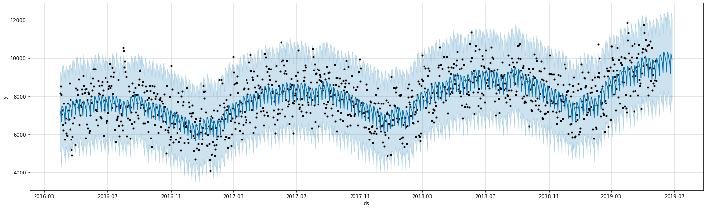

```python
# Import the needed libraries 
## Attention:For the installation of Prophet please follow the instructions written here:  https://stackoverflow.com/questions/53178281/installing-fbprophet-python-on-windows-10
import pandas as pd
import numpy as np
from fbprophet import Prophet
import matplotlib.pyplot as plt

```


```python
# Read in the given data and set the index column to the date column and parse the dates
df=pd.read_csv("../02_data_acquisition_understanding/01_data_source/sickness_table.csv", index_col="date", parse_dates=True ) 
df["drivers_atwork"]=df["n_duty"]+df["sby_need"]
df.index.freq="D" #Set the frequence to Daily
df.index
```


    DatetimeIndex(['2016-04-01', '2016-04-02', '2016-04-03', '2016-04-04',
                   '2016-04-05', '2016-04-06', '2016-04-07', '2016-04-08',
                   '2016-04-09', '2016-04-10',
                   ...
                   '2019-05-18', '2019-05-19', '2019-05-20', '2019-05-21',
                   '2019-05-22', '2019-05-23', '2019-05-24', '2019-05-25',
                   '2019-05-26', '2019-05-27'],
                  dtype='datetime64[ns]', name='date', length=1152, freq='D')


```python
# Prepare the Data for Prophet
# Create the column "date"
df["date"]=df.index
# Create new DataFrames with the column "date"
df_new=pd.DataFrame(df["date"])
# Create the column y="calls"
df_new["y"]=df["calls"]
# Delete the index
df_new.reset_index(drop=True, inplace=True)
# Rename the columns to the Prophet specifics
df_new.rename(columns={"date": "ds", "y": "y"}, inplace=True)
# Show the head of the DataFrame
df_new.head()
```


<div>
<style scoped>
    .dataframe tbody tr th:only-of-type {
        vertical-align: middle;
    }

    .dataframe tbody tr th {
        vertical-align: top;
    }

    .dataframe thead th {
        text-align: right;
    }
</style>
<table border="1" class="dataframe">
  <thead>
    <tr style="text-align: right;">
      <th></th>
      <th>ds</th>
      <th>y</th>
    </tr>
  </thead>
  <tbody>
    <tr>
      <th>0</th>
      <td>2016-04-01</td>
      <td>8154.0</td>
    </tr>
    <tr>
      <th>1</th>
      <td>2016-04-02</td>
      <td>8526.0</td>
    </tr>
    <tr>
      <th>2</th>
      <td>2016-04-03</td>
      <td>8088.0</td>
    </tr>
    <tr>
      <th>3</th>
      <td>2016-04-04</td>
      <td>7044.0</td>
    </tr>
    <tr>
      <th>4</th>
      <td>2016-04-05</td>
      <td>7236.0</td>
    </tr>
  </tbody>
</table>
</div>


```python
#Define the number of days the model should predict the workforce plan
numberofdaysforprediction=31

#Create the Prohpet-Model,with an interval_width of 95% (95% of the train values are in the predicted range) 
m = Prophet(interval_width=0.975, daily_seasonality=True,seasonality_mode="multiplicative")
# Train the Prophet-Model
m.fit(df_new)
# Create future datafame with xx days (periods & freq) as basis for prediction
future = m.make_future_dataframe(periods=numberofdaysforprediction,freq='D')
# Make predictions for the created future dataframe
forecast = m.predict(future)
#plot the predictions 
m.plot(forecast, figsize=(20, 6));
forecast.set_index(forecast["ds"], inplace=True)

```


    

    


```python
# Generating the prdiction of drivers on duty and drivers on standby for the next 31 days
x_Value=4.82
df_predresult=pd.DataFrame(forecast["ds"].iloc[len(forecast)-numberofdaysforprediction:])
df_predresult["pred_n_duty"]=forecast["yhat"].iloc[len(forecast)-numberofdaysforprediction:]/x_Value
df_predresult["pred_n_sby"]=forecast["yhat_upper"].iloc[len(forecast)-numberofdaysforprediction:]/x_Value-forecast["yhat"].iloc[len(forecast)-numberofdaysforprediction:]/x_Value

#Round the values and cast to intger: 
df_predresult["pred_n_duty"]=df_predresult["pred_n_duty"].apply(lambda x: np.around(x))
df_predresult["pred_n_duty"]=df_predresult["pred_n_duty"].apply(lambda x: int(x))
df_predresult["pred_n_sby"]=df_predresult["pred_n_sby"].apply(lambda x: np.around(x))
df_predresult["pred_n_sby"]=df_predresult["pred_n_sby"].apply(lambda x: int(x))
#drop the column "ds" since the index is already the date 
df_predresult.drop("ds", inplace=True, axis=1)
```


```python
# Show the predictions for the next 31 days
df_predresult
```


<div>
<style scoped>
    .dataframe tbody tr th:only-of-type {
        vertical-align: middle;
    }

    .dataframe tbody tr th {
        vertical-align: top;
    }

    .dataframe thead th {
        text-align: right;
    }
</style>
<table border="1" class="dataframe">
  <thead>
    <tr style="text-align: right;">
      <th></th>
      <th>pred_n_duty</th>
      <th>pred_n_sby</th>
    </tr>
    <tr>
      <th>ds</th>
      <th></th>
      <th></th>
    </tr>
  </thead>
  <tbody>
    <tr>
      <th>2019-05-28</th>
      <td>2071</td>
      <td>437</td>
    </tr>
    <tr>
      <th>2019-05-29</th>
      <td>2052</td>
      <td>418</td>
    </tr>
    <tr>
      <th>2019-05-30</th>
      <td>2025</td>
      <td>445</td>
    </tr>
    <tr>
      <th>2019-05-31</th>
      <td>2007</td>
      <td>440</td>
    </tr>
    <tr>
      <th>2019-06-01</th>
      <td>1975</td>
      <td>455</td>
    </tr>
    <tr>
      <th>2019-06-02</th>
      <td>1880</td>
      <td>438</td>
    </tr>
    <tr>
      <th>2019-06-03</th>
      <td>2104</td>
      <td>439</td>
    </tr>
    <tr>
      <th>2019-06-04</th>
      <td>2109</td>
      <td>439</td>
    </tr>
    <tr>
      <th>2019-06-05</th>
      <td>2091</td>
      <td>425</td>
    </tr>
    <tr>
      <th>2019-06-06</th>
      <td>2063</td>
      <td>444</td>
    </tr>
    <tr>
      <th>2019-06-07</th>
      <td>2045</td>
      <td>410</td>
    </tr>
    <tr>
      <th>2019-06-08</th>
      <td>2010</td>
      <td>438</td>
    </tr>
    <tr>
      <th>2019-06-09</th>
      <td>1913</td>
      <td>428</td>
    </tr>
    <tr>
      <th>2019-06-10</th>
      <td>2134</td>
      <td>434</td>
    </tr>
    <tr>
      <th>2019-06-11</th>
      <td>2136</td>
      <td>426</td>
    </tr>
    <tr>
      <th>2019-06-12</th>
      <td>2113</td>
      <td>426</td>
    </tr>
    <tr>
      <th>2019-06-13</th>
      <td>2081</td>
      <td>444</td>
    </tr>
    <tr>
      <th>2019-06-14</th>
      <td>2059</td>
      <td>419</td>
    </tr>
    <tr>
      <th>2019-06-15</th>
      <td>2020</td>
      <td>499</td>
    </tr>
    <tr>
      <th>2019-06-16</th>
      <td>1918</td>
      <td>443</td>
    </tr>
    <tr>
      <th>2019-06-17</th>
      <td>2135</td>
      <td>439</td>
    </tr>
    <tr>
      <th>2019-06-18</th>
      <td>2134</td>
      <td>446</td>
    </tr>
    <tr>
      <th>2019-06-19</th>
      <td>2108</td>
      <td>421</td>
    </tr>
    <tr>
      <th>2019-06-20</th>
      <td>2073</td>
      <td>429</td>
    </tr>
    <tr>
      <th>2019-06-21</th>
      <td>2048</td>
      <td>430</td>
    </tr>
    <tr>
      <th>2019-06-22</th>
      <td>2007</td>
      <td>426</td>
    </tr>
    <tr>
      <th>2019-06-23</th>
      <td>1904</td>
      <td>419</td>
    </tr>
    <tr>
      <th>2019-06-24</th>
      <td>2121</td>
      <td>442</td>
    </tr>
    <tr>
      <th>2019-06-25</th>
      <td>2120</td>
      <td>451</td>
    </tr>
    <tr>
      <th>2019-06-26</th>
      <td>2095</td>
      <td>443</td>
    </tr>
    <tr>
      <th>2019-06-27</th>
      <td>2061</td>
      <td>436</td>
    </tr>
  </tbody>
</table>
</div>


```python
# Create an extract as csv --> the separator is a Semikolon and the decimals is a comma
df_predresult.to_csv("Workforceplaning.csv", decimal=",",sep=";")
```


```python

```
